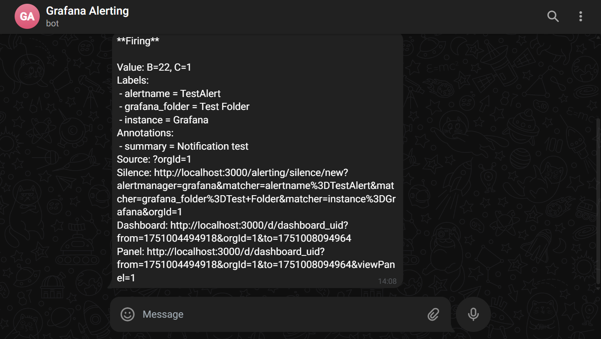

# 📘 Final Task

## 1 - Provisioning

**Instructions**

- Attach SSH keys & IP configuration to all VMs
- Server Configuration using Ansible

---

1. Rebuild semua server lalu gunakan 1 SSH key ke kedua server tersebut
   
2. Gunakan 1 key SSH lalu konfigurasikan ke semua seperti di Biznetgio, Github, Jenkins, Local windows dan WSL (untuk Ansible). Buat juga config di local untuk mempermudah masuk ke server via SSH.

```
Host vps-app
    HostName 103.127.137.206
    User totywan
    IdentityFile ~/.ssh/key

Host gateway
    HostName 103.127.138.159
    User totywan
    IdentityFile ~/.ssh/key
```

3. Apabila SSH key yang dipakai pernah digunakan maka lakukan seperti gambar dibawah:
   

4. Login ulang, jika sudah selesai.
5. Buat Inventory untuk konfigurasi server menggunakan ansible

```bash
[app_server]
103.127.137.206

[gateway_server]
103.127.138.159

[app_server:vars]
ansible_user=totywan
ansible_ssh_private_key_file=~/.ssh/key
ansible_python_interpreter=/usr/bin/python3.10

[gateway_server:vars]
ansible_user=totywan
ansible_ssh_private_key_file=~/.ssh/key
ansible_python_interpreter=/usr/bin/python3.10
```

6.  Buat file ansible.cfg untuk mengkonfigurasi behavior Ansible saat kita menjalankan perintah-perintah ansible

```bash
[defaults]
inventory=./inventory
host_key_checking=false
```

    - host_key_checking digunakan untuk menghindari host key checking saat pertama kali connect ke server baru

---

## 2 - Repository

**Instructions**

- Create a repository on Github or Gitlab
- **Private** repository access
- Set up 2 branches
  - Staging
  - Production
- Each Branch have their own CI/CD

---

1. Buat repository untuk aplikasi di github dan set private

2. Fork repo fe-dumbmerch dan be-dumbmerch kemudian pindahkan ke repo github yang sudah dibuat

3. Buat branch staging dan branch production kemudian push repository
   
   
   

4. Karena menggunakan fork dan hanya mengcopy ke repo kita, maka pada git akan muncul `mode 1600000` yang berarti direktori fe dan be merupakan submodule Git. Hal ini dapat membuat CI/CD dan Docker Build tidak aman karena:

- CI/CD bisa gagal kalau tidak diatur untuk clone submodule (git clone --recurse-submodules)

- Docker build bisa error, terutama jika Dockerfile butuh isi folder tetapi yang ada cuma placeholder submodule

Oleh karena itu lakukan

```
# Hapus submodule dari index
git rm --cached fe-dumbmerch
git rm --cached be-dumbmerch

# Hapus .git folder di dalamnya
rm -rf fe-dumbmerch/.git
rm -rf be-dumbmerch/.git

# Tambahkan ulang sebagai folder biasa
git add .
git commit -m "Fix: convert submodules to normal folders"
git push origin staging

```

Lakukan hal yang sama di branch production

5. Buat Jenkinsfile di tiap branch untuk CI/CD tiap branch
   
   

## 3 - Servers

**Instructions**

- Create new user `finaltask-$USER` (this new user was your final tasks playground)
- Server login with SSH key and Password
- Create a working **SSH config** to log into servers
- Only use **1 SSH keys** for all purpose (Repository, CI/CD etc.)
- UFW enabled with only used ports allowed
- Change ssh port from (22) to (1234)

---

1. Buat file `.yml` yang berisi task SSH config yang akan dijalankan via ansible-playbook

```.yml
- hosts: app_server, gateway_server
  become: true
  tasks:
    - name: Create user finaltask-totywan
      user:
        name: finaltask-totywan
        shell: /bin/bash
        groups: sudo
        append: yes
        create_home: yes

    - name: Set authorized key for finaltask-totywan
      authorized_key:
        user: finaltask-totywan
        state: present
        key: "{{ lookup('file', '~/.ssh/key.pub') }}"

    - name: Set password login untuk finaltask-totywan
      user:
        name: finaltask-totywan
        password: "{{ 'totywan' | password_hash('sha512') }}"

    - name: Change SSH port to 1234
      lineinfile:
        path: /etc/ssh/sshd_config
        regexp: '^#?Port'
        line: 'Port 1234'
        state: present

    - name: Allow ports used via UFW
      ufw:
        rule: allow
        port: "{{ item }}"
      loop:
        - 1234   # SSH
        - 80     # HTTP
        - 443    # HTTPS
        - 5432   # PostgreSQL
        - 9000   # Sonarqube
        - 5000

    - name: Enable UFW
      ufw:
        state: enabled
        policy: deny

    - name: Restart SSH to apply port change
      service:
        name: ssh
        state: restarted
    - name: Allow finaltask-totywan to sudo without password
      lineinfile:
        dest: /etc/sudoers.d/finaltask-totywan
        line: "finaltask-totywan ALL=(ALL) NOPASSWD:ALL"
        create: yes
        state: present
        mode: '0440'
```

2.  Karena telah membuat user baru yang digunakan untuk keseluruhan final task, ubah inventory dari Ansible dan config ssh untuk user yang mengelola VM

```inventory
[app_server]
103.127.137.206

[gateway_server]
103.127.138.159

[app_server:vars]
ansible_user=finaltask-totywan
ansible_ssh_private_key_file=~/.ssh/key
ansible_python_interpreter=/usr/bin/python3.10
ansible_port=1234

[gateway_server:vars]
ansible_user=finaltask-totywan
ansible_ssh_private_key_file=~/.ssh/key
ansible_python_interpreter=/usr/bin/python3.10
ansible_port=1234
```

```config
Host vps-app
    HostName 103.127.137.206
    User finaltask-totywan
    Port 1234
    IdentityFile ~/.ssh/key

Host gateway
    HostName 103.127.138.159
    User finaltask-totywan
    Port 1234
    IdentityFile ~/.ssh/key
```

3. Coba masuk menggunakan user tersebut dan periksa UFW statusnya
   

## 4 - Container Registry

**Instructions**

[ *Docker Registry* ]

- Deploy Docker Registry Private on this server
- Push your image into Your Own Docker Registry
- reverse proxy for docker registry was registry.{your_name}.studentdumbways.my.id

[*Reference*]
([Docker Registry Private](https://hub.docker.com/_/registry))

---

Arsitektur

```

┌──────────────┐     registry.hermanto.studentdumbways.my.id
│ Gateway VPS  │  ⇐═════════════════════════════════════  (HTTPS Reverse Proxy)
│ (nginx)      │
└──────────────┘           │
                           ▼
                 ┌────────────────┐
                 │ App Server     │
                 │ Docker Registry│
                 └────────────────┘

```

1. Buat playbook Install Docker Registry di app server

```.yml
- name: Install Docker
  hosts: app_server, gateway_server
  become: true
  tasks:
    - name: Install required packages
      apt:
        name:
          - apt-transport-https
          - ca-certificates
          - curl
          - gnupg
          - lsb-release
        state: present
        update_cache: yes

    - name: Add Docker GPG key
      apt_key:
        url: https://download.docker.com/linux/ubuntu/gpg
        state: present

    - name: Add Docker APT repository
      apt_repository:
        repo: "deb [arch=amd64] https://download.docker.com/linux/ubuntu {{ ansible_distribution_release }} stable"
        state: present

    - name: Install Docker
      apt:
        name:
          - docker-ce
          - docker-ce-cli
          - containerd.io
        state: latest

    - name: Enable and start Docker service
      systemd:
        name: docker
        enabled: yes
        state: started
    - name: Add 'finaltask-totywan' user to docker group
      user:
        name: finaltask-totywan
        groups: docker
        append: yes
- name: Run Docker Registry
  hosts: app_server
  become: true
  tasks:
    - name: Create registry data dir
      file:
        path: /home/finaltask-totywan/registry/data
        state: directory
        recurse: yes
        owner: finaltask-totywan

    - name: Run Docker Registry container
      docker_container:
        name: registry
        image: registry:2
        state: started
        restart_policy: always
        published_ports:
          - "5000:5000"
        volumes:
          - /home/finaltask-totywan/registry/data:/var/lib/registry
```

2. Cek apakah registry berhasil berjalan dengan baik.
   

3. Buat playbook install nginx di gateway server

```.yml
- name: Install and configure Nginx as reverse proxy for Docker Registry
  hosts: gateway_server
  become: true
  vars:
    registry_domain: "registry.hermanto.studentdumbways.my.id"
    app_server_ip: "103.127.137.206"
  tasks:
    - name: Install Nginx
      apt:
        name: nginx
        state: present
        update_cache: true

    - name: Ensure Nginx is started and enabled
      systemd:
        name: nginx
        state: started
        enabled: true

    - name: Configure Nginx reverse proxy for Docker Registry
      copy:
        dest: /etc/nginx/sites-available/docker-registry
        content: |
          server {
              listen 80;
              server_name {{ registry_domain }};

              location / {
                  proxy_pass http://{{ app_server_ip }}:5000;
                  proxy_set_header Host $host;
                  proxy_set_header X-Real-IP $remote_addr;
                  proxy_set_header X-Forwarded-For $proxy_add_x_forwarded_for;
                  proxy_set_header X-Forwarded-Proto $scheme;
              }
          }
      notify: Reload Nginx

    - name: Enable Docker Registry site
      file:
        src: /etc/nginx/sites-available/docker-registry
        dest: /etc/nginx/sites-enabled/docker-registry
        state: link
        force: true

    - name: Remove default nginx site
      file:
        path: /etc/nginx/sites-enabled/default
        state: absent

  handlers:
    - name: Reload Nginx
      service:
        name: nginx
        state: reloaded
```

4. Tes apakah nginx sudah running dan reverse proxy sudah benar. (sementara menggunakan HTTP karena SSL akan dikonfigurasi di akhir menggunakan wildcard)
   
   
   

## 5 - Deployment

**_Instruction_**

[ *Database* ]

- App database using _PostgreSQL_
- Deploy postgresql on top docker
- Set the volume location in `/home/$USER/`
- Allow database to remote from another server\*

[ *Application* ]

- Create a Docker image for frontend & backend
- Staging & Production: A lightweight docker image (as small as possible)
- Building Docker image on every environment using docker multistage build\*
- Create load balancing for frontend and backend\*

---

1. Konfigurasi SSH dengan github terlebih dahulu, agar dapat melakukan pull dari repo app, dapat menggunakan Ansible dengan playbook di bawah:

```ansible
- name: Setup SSH for GitHub
  hosts: app_server, gateway_server
  become: true
  vars:
    ssh_dir: "/home/finaltask-totywan/.ssh"
    github_repo: "git@github.com:hermanto-cpu/final-task-app-dumbways.git"
    repo_dir: "/home/finaltask-totywan/final-task-app"

  tasks:
    - name: Ensure .ssh directory exists
      file:
        path: "{{ ssh_dir }}"
        state: directory
        owner: finaltask-totywan
        group: finaltask-totywan
        mode: "0700"

    - name: Copy private key
      copy:
        src: ~/.ssh/key
        dest: "{{ ssh_dir }}/key"
        owner: finaltask-totywan
        group: finaltask-totywan
        mode: "0600"

    - name: Copy public key
      copy:
        src: ~/.ssh/key.pub
        dest: "{{ ssh_dir }}/key.pub"
        owner: finaltask-totywan
        group: finaltask-totywan
        mode: "0644"

    - name: Configure SSH to use custom key for github.com
      copy:
        dest: "{{ ssh_dir }}/config"
        content: |
          Host github.com
            HostName github.com
            User git
            IdentityFile {{ ssh_dir }}/key
            StrictHostKeyChecking no
        owner: finaltask-totywan
        group: finaltask-totywan
        mode: "0644"

    - name: Ensure git is installed
      apt:
        name: git
        state: present
        update_cache: yes

- name: Clone Repo to app server
  hosts: app_server
  become: true
  tasks:
    - name: Clone GitHub repo (final-task-app-dumbways)
      become_user: finaltask-totywan
      git:
        repo: "{{ github_repo }}"
        dest: "{{ repo_dir }}"
        version: staging
        accept_hostkey: yes
```

2. Cek apakah github dapat terkoneksi melalui SSH dan repo terclone
   

3. Buat `.env` file di fe-dumbmerch

- Untuk staging

```
cd /home/finaltask-totywan/final-task-app/fe-dumbmerch
echo "REACT_APP_BASEURL=https://staging.api.hermanto.studentdumbways.my.id/api/v1" > .env
```

- Untuk prod

```
cd /home/finaltask-totywan/final-task-app/fe-dumbmerch
echo "REACT_APP_BASEURL=https://api.hermanto.studentdumbways.my.id/api/v1" > .env
```

4. Buat Dockerfile didalam fe-dumbmerch

```
# Stage 1: Build React App
FROM node:16-alpine as build
WORKDIR /app
COPY package*.json ./
RUN npm install
COPY . .
RUN npm run build

# Stage 2: Serve with NGINX
FROM nginx:alpine
COPY --from=build /app/build /usr/share/nginx/html
EXPOSE 80
CMD ["nginx", "-g", "daemon off;"]
```

- Karena fe-dumbmerch adalah React app (Single Page Application) yang saat di build (npm run build) akan menghasilkan static files di /build

- Static files (HTML, JS, CSS) tersebut idealnya disajikan dengan web server seperti NGINX

- Oleh karena itu, di Dockerfile yang kita lakukan adalah Membangun project di NodeJS → Copy hasilnya ke image NGINX → Serve static file menggunakan NGINX

- command `-g "daemon off;"`: memberi tahu nginx jangan masuk background (daemon), tetap di foreground. Karena Docker container akan berhenti kalau proses utamanya selesai. Maka nginx harus tetap aktif di depan (foreground).

- Setelah itu image hasil Dockerfile tersebut akan lebih ringan.

5. Build docker file menggunakan nama domain registry beserta tag agar dapat langsung kita pull ke registry private kita. Ex: `docker build -t registry.hermanto.studentdumbways.my.id/fe-dumbmerch:staging .`
   

6. Cek Docker Images dan jalankan image front-end yang telah dibuild `docker run -d --name frontend-staging -p 3000:80 registry.hermanto.studentdumbways.my.id/fe-dumbmerch:staging`
   

7. Cek apakah front-end dapat diakses dan dirender melalui browser
   
   

8. Push Image front end ke docker registry

- Karena domain untuk reverse proxy registry saya belum memiliki SSL maka harus dilakukan konfigurasi terlebih dahulu agar Docker dapat melakukan push melalui HTTP untuk domain tersebut.
- Edit file Docker daemon config di app server`sudo nano /etc/docker/daemon.json`
- Masukkan konfigurasi

```{
  "insecure-registries": ["registry.hermanto.studentdumbways.my.id"]
  }

```

- Restart Docker daemon:

```

sudo systemctl daemon-reexec
sudo systemctl restart docker
```


9. Sekarang kita lanjut untuk deployment backend dan database, Buat docker compose untuk database

10. Sesuaikan .env untuk backend
    
    

11. Buat Dockerfile untuk backend

```Dockerfile
# Stage 1 - Build
FROM golang:1.16 AS builder

WORKDIR /app

COPY go.mod ./
COPY go.sum ./
RUN go mod download

COPY . .
RUN go build -o app .

# Stage 2 - Run
FROM debian:bullseye-slim

WORKDIR /app

COPY --from=builder /app/app .
COPY --from=builder /app/.env .

EXPOSE 5001

CMD ["./app"]

```

12. Build Dockerfile `docker build -t registry.hermanto.studentdumbways.my.id/be-dumbmerch:staging .`
13. Buat docker compose agar database dan backend dapat satu network container

```docker-compose.yml
version: '3.8'
services:
  db:
    image: postgres:13
    container_name: postgres-dumbmerch
    restart: always
    environment:
      POSTGRES_USER: dumbuser
      POSTGRES_PASSWORD: dumbpass
      POSTGRES_DB: dumbmerch
    ports:
      - "5432:5432"
    volumes:
      - /home/finaltask-totywan/postgres-data:/var/lib/postgresql/data

  backend:
    build:
      context: ./be-dumbmerch
    container_name: backend-staging
    env_file:
      - ./be-dumbmerch/.env
    ports:
      - "5001:5001"
    depends_on:
      - db

```

14. Jalankan `docker compose up -d`

15. Cek logs dan juga coba akses via browser
    
    

---

## 6 - CI/CD

**Instructions**

[ *CI/CD* ]

- Create a pipeline running:
  - Repository pull
  - Image build
  - Testing Your Code
  - Push Image into your own docker registry private
  - SSH into your server
  - Pull image from docker registry private
  - Redeploy your deployment apps
- For testing Stage, you must use sonarqube for testing your code quality
  - Sonarqube\*
    - On your cicd workflow, use sonarqube for testing your quality code.
    - You can use others testing tools like trivy for scanning your images or some.
    - And try test your running app by using `wget spider`

---

1. Jalankan Jenkins menggunakan Docker di port yang berbeda dengan cAdvisor (Monitoring untuk Task 7) `docker run -d -v jenkins_home:/var/jenkins_home -p 8180:8080 -p 50000:50000 --restart=on-failure jenkins/jenkins:lts-jdk17`

2. Buka logs dari container Jenkins untuk mengambil password administrator

3. Konfigurasikan credential SSH (gunakan 1 ssh yang dari awal) untuk akun github dan untuk pipeline ke server.

4. Masuk ke Manage Jenkins > Credentials > (global) > (Add Credentials) > Kind: SSH Username with private key

5. Gunakan Private key untuk server dan Github.

6. Apabila di server tidak ada known_host, atur security Host Key Verification Strategy di Jenkins menjadi Accept first connection agar dapat mengenerate untuk pertama kali.

7. Buat pipeline untuk finaltask-app staging

8. Install SonarQube (Dikarenakan server tidak punya resource yang cukup untuk menjalankan di server maka saya install melalui windows)

9. Akses via browser

- Login default:

- Username: admin

- Password: admin

10. Buat Project dan beri nama yang diganakan untuk Project Key agar testing code dapat ditampilkan di server SonarQube
    
    

11. Buat Token di sonarqube. Masuk Administrator > Security > User > Click Generate Token > Copy Token
    

12. Masukkan Token tersebut di Jenkins. Masuk Jenkins > Manage Jenkins > System > Scroll kebawah > Isi token dengan add server authentication token > Pilih Secret text > Lalu pilih server authentication token yang telah ditambahkan tadi
    
    

- Nama digunakan untuk environtment SonarQube

13. Karena disini saya menggunakan windows, maka memerlukan tunneling agar Jenkins dalam container VPS dapat mengaksesnya. Jika tidak maka akan ada error seperti dibawah
    
14. Untuk tunneling dapat menggunakan ngrok. Oleh karena itu, Selanjutnya install ngrok
    
15. Lalu di Command Line Interface jalankan `ngrok http 9000` agar dibuatkan reverse proxy pada localhost 9000
    

16. Konfigurasikan ulang di Jenkins
    
17. Masuk ke Manage Jenkins > tool > Scroll kebawah hingga menemukan Sonarscanner > Beri nama sesuai untuk tool tempat sonar scanner
    

- Nama tool digunakan untuk directory home tool SonnarScanner

```
stage('SonarQube Analysis') {
            environment {
                scannerHome = tool 'Sonar'
            }
            steps {
                script {
                    withSonarQubeEnv('jenkins-sq') {
                        sh "${scannerHome}/bin/sonar-scanner \
                            -Dsonar.projectKey=Jenkins \
                            -Dsonar.projectName=Jenkins \
                            -Dsonar.sources=."
                    }
                }
            }
}
```

18. Di Repo Staging buat Jenkinsfile berikut

```
def secret = 'finaltask-totywan-app-server'
def server = 'finaltask-totywan@103.127.137.206'
def sshPort = '1234'
def directory = '/home/finaltask-totywan/final-task-app'
def directoryFe = "${directory}/fe-dumbmerch"
def directoryBe = "${directory}/be-dumbmerch"
def branch = 'staging'
def imageFe = 'registry.hermanto.studentdumbways.my.id/fe-dumbmerch:staging'
def imageBe = 'registry.hermanto.studentdumbways.my.id/be-dumbmerch:staging'
def sonarqube = 'jenkins-sq'
pipeline {
    agent any
    stages {
        stage ('Pull Latest Code from GitHub') {
            steps {
                sshagent([secret]) {
                    sh """
                        ssh -p ${sshPort} -o StrictHostKeyChecking=no ${server} << EOF
                            cd ${directory}
                            git pull origin ${branch}
                            echo "✅ Pulled latest code"
                            exit
                        EOF
                    """
                }
            }
        }

        stage ('Build Docker Image FE') {
            steps {
                sshagent([secret]) {
                    sh """
                        ssh -p ${sshPort} -o StrictHostKeyChecking=no ${server} << EOF
                            cd ${directoryFe}
                            docker build -t ${imageFe} .
                            docker push ${imageFe}
                            echo "✅ Frontend image built & pushed"
                            exit
                        EOF
                    """
                }
            }
        }

        stage ('Build Docker Image BE') {
            steps {
                sshagent([secret]) {
                    sh """
                        ssh -p ${sshPort} -o StrictHostKeyChecking=no ${server} << EOF
                            cd ${directoryBe}
                            docker build -t ${imageBe} .
                            docker push ${imageBe}
                            echo "✅ Backend image built & pushed"
                            exit
                        EOF
                    """
                }
            }
        }

        stage('SonarQube Analysis') {
            environment {
                scannerHome = tool 'Sonar'
            }
            steps {
                script {
                    withSonarQubeEnv('jenkins-sq') {
                        sh "${scannerHome}/bin/sonar-scanner \
                            -Dsonar.projectKey=Jenkins \
                            -Dsonar.projectName=Jenkins \
                            -Dsonar.sources=."
                    }
                }
            }
        }


        stage('Deploy Frontend Container') {
            steps {
                sshagent([secret]) {
                    sh """
                        ssh -p ${sshPort} -o StrictHostKeyChecking=no ${server} << EOF
                            docker stop frontend-staging || true
                            docker rm frontend-staging || true
                            docker run -d --name frontend-staging -p 3000:80 ${imageFe}
                            echo "🚀 Deployed frontend!"
                            exit
                        EOF
                    """
                }
            }
        }

        stage('Deploy Backend via Docker Compose') {
            steps {
                sshagent([secret]) {
                    sh """
                        ssh -p ${sshPort} -o StrictHostKeyChecking=no ${server} << EOF
                            cd ${directory}
                            docker compose down
                            docker compose pull
                            docker compose up -d
                            echo "🚀 Backend deployed!"
                            exit
                        EOF
                    """
                }
            }
        }

        stage('Health Check with wget') {
            steps {
                sshagent([secret]) {
                    sh """
                        ssh -p ${sshPort} -o StrictHostKeyChecking=no ${server} << EOF
                                echo "🔎 Checking Frontend..."
                                if wget --spider -q http://103.127.137.206:3000; then
                                    echo "✅ Frontend up"
                                else
                                    echo "❌ Frontend down"
                                fi

                                echo "🔎 Checking Backend..."
                                if wget --spider --server-response -q http://103.127.137.206:5001 2>&1 | grep -q "HTTP/1.1"; then
                                    echo "✅ Backend up"
                                else
                                    echo "❌ Backend down"
                                fi

                                echo "✅ Health check done"
                            exit
                        EOF
                    """
                }
            }
        }
    }
}


```

- PENTINGG!!!! PASTIKAN PLUGIN SSH AGENT DAN SONARSCANNER TELAH TERINSTALL DI JENKINS
- Jika kasusnya ingin menggunakan image yang ada di Docker registry private dapat langsung dengan ex:

```
  stage ('Pull Docker Image BE') {
            steps {
                sshagent([secret]) {
                    sh """
                        ssh -p ${sshPort} -o StrictHostKeyChecking=no ${server} << EOF
                            docker pull ${imageBe}
                            echo "✅ Image Pull Successfully"
                            exit
                        EOF
                    """
                }
            }
        }
```

19. Setelah itu kualitas kode aplikasi akan berhasil di testing menggunakan sonarqube dan aplikasi berhasil di deploy.

## 

---

# Deployment Production

Deployment untuk lingkungan production belum sepenuhnya diimplementasikan dalam project ini. Namun, dapat dilakukan dengan melakukan penyesuaian pada beberapa aspek berikut:

- Dockerfile Backend & Frontend: Sesuaikan konfigurasi Dockerfile untuk mengoptimalkan keamanan, performa, dan ukuran image.

- Environment Configuration: Ubah variabel .env dan endpoint dari API agar sesuai dengan kebutuhan production.

- Frontend Optimization:

  - Disarankan menggunakan distroless image berbasis Node.js 16 untuk membuat image lebih ringan dan aman.

- Backend Optimization dari staging sebelumnya:

```
# Stage 1 - Build
FROM golang:1.16-alpine AS builder

WORKDIR /app

COPY go.mod go.sum ./
RUN go mod download

COPY . .

# Build binary statically
RUN CGO_ENABLED=0 GOOS=linux go build -o app .

# Stage 2 - Production (Distroless)
FROM gcr.io/distroless/static:nonroot

WORKDIR /app

COPY --from=builder /app/app .
COPY --from=builder /app/.env .  # .env sebaiknya dimount via secret/env, bukan bake ke image

USER nonroot
EXPOSE 5001

ENTRYPOINT ["/app/app"]

```

| Perubahan                          | Tujuan                                                                                                                                         |
| ---------------------------------- | ---------------------------------------------------------------------------------------------------------------------------------------------- |
| `CGO_ENABLED=0`                    | Agar hasil binary bisa jalan di `distroless:static` (karena image distroless tidak punya libc, jadi wajib bikin binary statis agar bisa jalan) |
| `gcr.io/distroless/static:nonroot` | Runtime image sangat kecil, tidak punya shell atau root user                                                                                   |
| `USER nonroot`                     | Lebih aman: container tidak jalan sebagai root                                                                                                 |

- Untuk kebutuhan skalabilitas tinggi, dapat mengimplementasikan load balancer.

---

## 7 - Monitoring

**Instructions**

- Create Basic Auth into your Prometheus\*
- Monitor resources for all your servers
- Create a fully working dashboard in Grafana
  - Disk
  - Memory Usage
  - CPU Usage
  - VM Network
  - Monitoring all of container resources on VM
- Grafana Alert/Prometheus Alertmanager for:
  - Send Notification to Telegram
  - CPU Usage
  - RAM Usage
  - Free Storage
  - Network I/O (NGINX Monitoring)

---

1. Install Exporter di tiap server untuk mengambil data metrics dari server tersebut, Dapat juga Install Prometheus dan Grafana di gateway server agar tidak terlalu membebankan app server (disini saya install Prometheus di app_server). Dapat menggunakan Ansible untuk mempermudah. Buat file `.yml` tiap image yang akan dijalankan via docker

- grafana.yml

```grafana.yml
version: "3.8"

services:
  grafana:
    image: grafana/grafana
    container_name: grafana
    ports:
      - "3000:3000"
    restart: unless-stopped
```

- node-exporter.yml

```node-exporter.yml
version: "3.8"

services:
  node-exporter:
    image: prom/node-exporter
    container_name: node-exporter
    ports:
      - 9100:9100
    restart: unless-stopped
    pid: "host"
    volumes:
      - /proc:/host/proc:ro
      - /sys:/host/sys:ro
      - /:/rootfs:ro
    command:
      - "--path.procfs=/host/proc"
      - "--path.sysfs=/host/sys"
      - "--path.rootfs=/rootfs"
```

- prometheus.yml

```prometheus.yml
version: "3.8"

services:
  prometheus:
    image: prom/prometheus
    container_name: prometheus
    volumes:
      - ./prometheus:/etc/prometheus
    ports:
      - "9090:9090"
    command:
      - "--config.file=/etc/prometheus/prometheus.yml"
      - "--web.enable-lifecycle"
    restart: unless-stopped
```

2. Buat file `prometheus.yml` didalam folder prometheus untuk konfigurasi prometheus yang akan mengelola data metrics yang dikeluarkan oleh exporter.

```prometheus.yml
global:
  scrape_interval: 15s

scrape_configs:
  - job_name: "final-task"
    static_configs:
      - targets: ["exporter.hermanto.studentdumbways.my.id", "exporter2.hermanto.studentdumbways.my.id"]
```

3. Buat file Ansible playbook

```finaltask-monitorinf.yml
- name: Setup Monitoring
  hosts: app_server,gateway_server
  become: true
  vars:
    locale: ./monitoring
    remote: /home/finaltask-totywan/monitoring
  tasks:
    - name: Buat direktori monitoring di server
      file:
        path: "{{ remote }}"
        state: directory
    - name: Buat direktori monitoring/prometheus di server
      file:
        path: "{{ remote }}/prometheus"
        state: directory

    - name: Copy node-exporter.yml ke remote
      copy:
        src: "{{ locale }}/node-exporter.yml"
        dest: "{{ remote }}/node-exporter.yml"

    - name: Jalankan node-exporter dengan docker compose
      community.docker.docker_compose_v2:
        files:
          - node-exporter.yml
        project_name: monitoring
        project_src: "{{ remote }}"

- name: Setup Prometheus hanya di gateway_server
  hosts: app_server
  become: true
  vars:
    locale: ./monitoring
    remote: /home/finaltask-totywan/monitoring
  tasks:
    - name: Salin docker-compose prometheus.yml ke remote
      copy:
        src: "{{ locale }}/prometheus.yml"
        dest: "{{ remote }}/prometheus.yml"

    - name: Salin config prometheus.yml ke folder prometheus
      copy:
        src: "{{ locale }}/prometheus/prometheus.yml"
        dest: "{{ remote }}/prometheus/prometheus.yml"

    - name: Jalankan prometheus
      community.docker.docker_compose_v2:
        files:
          - prometheus.yml
        project_name: monitoring
        project_src: "{{ remote }}"

- name: Jalankan Grafana di gateway_server saja
  hosts: gateway_server
  become: true
  vars:
    locale: ./monitoring
    remote: /home/finaltask-totywan/monitoring
  tasks:
    - name: Copy grafana.yml ke remote
      copy:
        src: "{{ locale }}/grafana.yml"
        dest: "{{ remote }}/grafana.yml"

    - name: Jalankan Grafana
      community.docker.docker_compose_v2:
        files:
          - grafana.yml
        project_name: monitoring
        project_src: "{{ remote }}"

```

4. Sehingga di local Ansible seperti ini susunan foldernya :

```
ansible/
├── finaltask-monitoring.yml
├── inventory
└── monitoring/
    ├── grafana.yml
    ├── node-exporter.yml
    ├── prometheus.yml
    └── prometheus/
        └── prometheus.yml

```

5. Jalankan ansible-playbook lalu cek apakah task berhasil berjalan tanpa ada yang keliru.
   
   
   
   

6. Lanjut untuk membuat basic auth untuk Prometheus. Install module bcrypt dari python 3 `sudo apt-get -y install python3-bcrypt` di local komputer menggunakan WSL

7. Buat file generate password `nano generate_password.py`

```
import getpass
import bcrypt

password = getpass.getpass("Enter a password: ")
hashed_password = bcrypt.hashpw(password.encode("utf-8"), bcrypt.gensalt())
print(hashed_password.decode())
```

8. Jalankan `python3 generate_password.py` dan buat password dari sana
   

9. Copy password yang telah di bcrypt tersebut lalu masukkan ke file `sudo nano /etc/prometheus/web.yml`
   

10. Masukkan web config ke aplikasi prometheus `--web.config.file=/etc/prometheus/web.yml` (dalam kasus saya saya build ulang menggunakan docker compose)
    
    

11. Coba akses Prometheus.
    

12. Masuk ke grafana

13. Tambahkan data source prometheus beserta basic authentication
    

14. Save and tes apakah ada error
    

15. Buat dashboard untuk memonitor:

- Disk
- Memory Usage
- CPU Usage
- VM Network
- Monitoring all of container resources on VM

16. Untuk memonitor semua container yang berjalan di setiap serverm dapat menggunakan cAdvisor

17. Jalankan cAdvisor di tiap server menggunakan docker

```
# monitoring/cadvisor.yml
version: "3.8"
services:
  cadvisor:
    image: gcr.io/cadvisor/cadvisor:latest
    container_name: cadvisor
    ports:
      - "8080:8080"
    volumes:
      - /:/rootfs:ro
      - /var/run:/var/run:ro
      - /sys:/sys:ro
      - /var/lib/docker/:/var/lib/docker:ro
    restart: unless-stopped

```

18. Jalankan via docker compose di tiap server.
    

19. Tambahkan confignya bagian scrape_configs di `prometheus/prometheus.yml`

```
scrape_configs:
 <!--Kode lain  -->
  - job_name: "cadvisor"
    static_configs:
      - targets: ["103.127.137.206:8080", "103.127.138.159:8080"]

```


20. Restart prometheus.
    
    
    

21. Masuk ke grafana dan buat dashboard untuk node-exporter full dan cAdvisor

- dashboard template dari grafana ID 1860
  
- dashboard template dari grafana ID 193
  
- dashboard template dari grafana ID 15331
  

22. Buat alerting. Pertama buat bot dulu menggunakan @BotFather -> /newbot -> Simpan BOT TOKEN

23. Buka link `api.telegram.org/bot<BOT_TOKEN>/getUpdates` untuk melihat pesan JSON yang dikirim dan ambil id dari JSON tersebut agar pesan dari bot terkirim ke user dengan chat id tersebut.
    
    
    

24. Masuk ke Grafana → Alerting → Contact points → Tambahkan Telegram → Isi Bot Token dan Chat ID
    
    

25. Buat alert rule

26. CPU Usage Alert

- Masukkan PromQL `100 - (avg by (instance) (rate(node_cpu_seconds_total{mode="idle"}[5m])) * 100)`
- Condition: WHEN > 80
- Konfigurasikan lainnya

27. RAM Usage Alert

- Masukkan PromQL `((node_memory_MemTotal_bytes - node_memory_MemAvailable_bytes) / node_memory_MemTotal_bytes) * 100`
- Condition: WHEN > 85
- Konfigurasikan lainnya

28. Free Disk Space Alert

- Masukkan PromQL `(node_filesystem_avail_bytes{mountpoint="/",fstype!~"tmpfs|overlay"}) / node_filesystem_size_bytes{mountpoint="/",fstype!~"tmpfs|overlay"} * 100`
- Condition: WHEN < 10 (berarti sisa disk kurang dari 10% total kapasitas)
- Konfigurasikan lainnya

29. Network I/O (NGINX Monitoring)
    > untuk mendeteksi network spike atau stagnasi, kita bisa awasi eth0 untuk bandwidth yang sangat tinggi atau sangat rendah.

- Masukkan PromQL (Total Receive + Transmit) `rate(node_network_receive_bytes_total{device="eth0"}[2m]) + rate(node_network_transmit_bytes_total{device="eth0"}[2m])`
- Condition: WHEN > 10000000 ( alert kalau bandwidth > 10MB/s)
- Konfigurasikan lainnya
  

30. Tes apakah alerting dapat memberi notif via bot telegram dengan mentrigger (misalnya penggunaan RAM seperti ss dibawah)
    
    
    > Template notifikasi dapat di edit dan disesuaikan dengan kebutuhan agar dapat lebih menarik dan mudah dipahami

## 8 - Web Server

**Instructions**

- All domains are HTTPS
- Create Bash Script for Automatic renewal for Certificates
- Create domains:

[ *Monitoring* ]

- exporter.<name>.studentdumbways.my.id - Node Exporter
- prom.<name>.studentdumbways.my.id - Prometheus
- monitoring.<name>.studentumbways.my.id - Grafana

[ *Docker Registry* ]

- registry.<name>.studentdumbways.my.id - Docker Registry

[ *Staging* ]

- staging.<name>.studentdumbways.my.id - App
- api.staging.<name>.studentdumbways.my.id - Backend API

[ *Production* ]

- <name>.studentdumbways.my.id - App
- api.<name>.studentdumbways.my.id - Backend API

---

1. Pastikan semua domain memiliki konfigurasi

- registry.hermanto.studentdumbways.my.id

```

server {
listen 80;
server_name registry.hermanto.studentdumbways.my.id;

    location / {
        proxy_pass http://103.127.137.206:5000;
    }

}

```

_Staging_

- staging.hermanto.studentdumbways.my.id

```

server {
listen 80;
server_name staging.hermanto.studentdumbways.my.id;

    location / {
        proxy_pass http://103.127.137.206:3000;
    }

}

```

- api.staging.hermanto.studentdumbways.my.id

```

server {
listen 80;
server_name api.staging.hermanto.studentdumbways.my.id;

    location / {
        proxy_pass http://103.127.137.206:5001;
    }

}

```

_Production_

- hermanto.studentdumbways.my.id

```

server {
listen 80;
server_name hermanto.studentdumbways.my.id;

    location / {
        proxy_pass http://103.127.137.206:3002;
    }

}

```

- api.hermanto.studentdumbways.my.id

```

server {
listen 80;
server_name api.hermanto.studentdumbways.my.id;

    location / {
        proxy_pass http://103.127.137.206:5002;
    }

}

```

_Monitoring_

- monitoring.hermanto.studentdumbways.my.id

```

server {
listen 80;
server_name monitoring.hermanto.studentdumbways.my.id;

    location / {
        proxy_pass http://103.127.138.159:3000;
    }

}

```

- prom.hermanto.studentdumbways.my.id

```

server {
listen 80;
server_name prom.hermanto.studentdumbways.my.id;

    location / {
        proxy_pass http://103.127.138.159:9000;
    }

}

```

- exporter.hermanto.studentdumbways.my.id

```

server {
listen 80;
server_name exporter.hermanto.studentdumbways.my.id;

        location / {
            proxy_pass http://103.127.137.206:9100;
      }

}

```

- exporter2.hermanto.studentdumbways.my.id

```

server {
listen 80;
server_name exporter2.hermanto.studentdumbways.my.id;

        location / {
            proxy_pass http://103.127.138.159:9100;
      }

}

```

2. Jalankan `sudo nginx -t` lalu reload nginx jika semua konfigurasi ok `sudo systemctl reload nginx`

3. Konfigurasi semua domain agar HTTPS menggunakan wildcard cerbot, step by step bisa dilihat di dokumentasi
   ([Cerbot Wildcard Instruction](https://certbot.eff.org/instructions?ws=nginx&os=snap&tab=wildcard))
4. Setelah selesai maka akan ada sertifikat ssl di `/etc/letsencrypt/live/hermanto.studentdumbways.my.id/`

5. Pasang file sertif SSL fullchain.pem dan privkey.pem di semua konfigurasi reverse proxy nginx. Dapat menggunakan command seperti dibawah ini:

```

for file in _; do
sudo sed -i '/server _{/a\
 listen 443 ssl;\
 ssl_certificate /etc/letsencrypt/live/hermanto.studentdumbways.my.id/fullchain.pem;\
 ssl_certificate_key /etc/letsencrypt/live/hermanto.studentdumbways.my.id/privkey.pem;\
 ' "$file"
done

```


6. Lanjut ke auto renew SSL karena Sertifikat dari Let's Encrypt (Certbot) hanya berlaku selama 90 hari. Jadi, perlu diperpanjang otomatis agar tidak kedaluwarsa. Buat ansible-playbook

```renew-ssl.yml
- name: Setup SSL Wildcard Renewal Script
  hosts: gateway_server
  become: yes

  vars:
    certbot_credentials_path: "/home/{{ ansible_user }}/.secrets/cloudflare.ini"
    ssl_renewal_script_path: "/opt/ssl-renewal.sh"
    ssl_renewal_log: "/var/log/ssl-renewal.log"

  tasks:
    - name: Create SSL renewal script
      copy:
        dest: "{{ ssl_renewal_script_path }}"
        mode: "0755"
        content: |
          #!/bin/bash
          echo "==== [ $(date) ] Starting SSL Renewal ===="
          certbot renew \
            --dns-cloudflare \
            --dns-cloudflare-credentials {{ certbot_credentials_path }} \
            --deploy-hook "systemctl reload nginx"
          echo "==== [ $(date) ] SSL Renewal Completed ===="

    - name: Ensure cron job exists to run SSL renewal daily
      cron:
        name: "Daily SSL Certbot Renewal"
        job: "{{ ssl_renewal_script_path }} >> {{ ssl_renewal_log }} 2>&1"
        minute: 0
        hour: 3
        user: root

```

7. Jalankan ansible-playbook
   

8. Tes apakah script berjalan dengan baik ketika dijalankan
   

---
